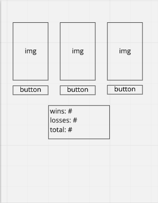

## The Golden Rule: 

🦸 🦸‍♂️ `Stop starting and start finishing.` 🏁

If you work on more than one feature at a time, you are guaranteed to multiply your bugs and your anxiety.

## Making a plan

1) **Make a drawing of your app. Simple "wireframes"**
1) **Once you have a drawing, name the HTML elements you'll need to realize your vision**
1) **For each HTML element ask: Why do I need this? (i.e., "we need div to display the results in")** 
1) **Once we know _why_ we need each element, think about how to implement the "Why" as a "How" (i.e., `resultsEl.textContent = newResults`)**
1) **Find all the 'events' (user clicks, form submit, on load etc) in your app. Ask one by one, "What happens when" for each of these events. Does any state change?**
1) **Think about how to validate each of your features according to a Definition of Done. (Hint: console.log usually helps here.)**
1) **Consider what features _depend_ on what other features. Use this dependency logic to figure out what order to complete tasks.**

Additional considerations:
- Ask: which of your HTML elements need to be hard coded, and which need to be dynamically generated?
- Consider your data model. 
  - What kinds of objects (i.e., Dogs, Friends, Todos, etc) will you need? 
  - What are the key/value pairs? 
  - What arrays might you need? 
  - What needs to live in a persistence layer?
- Is there some state we need to initialize?
- Ask: should any of this work be abstracted into functions? (i.e., is the work complicated? can it be resused?)

## Plan

- HTML Elements
  - three images
    - why? need three cups and one image to update per click to show the correct guess
    - how? cupImg.src = 'cup-with-ball.png'
  - three buttons
    - why? to let the user make a guess
    - how? button.addEventListener('click', () => {})
  - section with three "destination" elements
    - why? to display the state
    - how? destinationEl.textContent = wins || losses || total
- Events
  - User guesses by clicking one of the three buttons
    - State changes
      - total++
      - if correct guess, wins++
      - losses is derived: losses = total - wins
    - DOM updates
      - show where the ball is by changing img of correct container
      - show the new state in the elements that track wins, losses, and total
- Order
  - add HTML elements to index.html
    - include necessary class and ID tags
    - validate by looking at live server
  - add styling so that the images, button, and state container appear where i want them on the page
    - validate by looking at live server
  - get DOM elements in app.js
    - all image and button containers
    - the "destination" elements for state
    - validate by console.log(DOM elements)
  - initialize state
  - write functions
    - validate with console.log within functions
    - validate by calling functions
  - write event listeners
    - validate with console.log and by clicking buttons
  - adjust styling as needed

| User should be able to . . .                                                         |             |
| :----------------------------------------------------------------------------------- | ----------: |
| Visit the deployed pages on GitHub pages, with link in the About section of the Github repo|        2 |
| See three cups, with a button beneath each of them.                               |        2 |

| Events . . .                                                         |             |
| :----------------------------------------------------------------------------------- | ----------: |
| On clicking a cup button, the total number of guesses increment                         |        2 |
| On clicking the correct cup button, the total number of correct guesses increment                       |        2 |
| On clicking the incorrect cup button, the number of incorrect guesses increments                       |        2 |
| On click, see the correct cup's image change, clearing out the previous correct guess style|2|

| Functions                                                              |             |
| :----------------------------------------------------------------------------------- | ----------: |
| IMPURE: `resetStyles()` | 2 |
| IMPURE: `getRandomItem(arr) : returns random item from given array` | 2 |
| IMPURE: `handleGuess(userGuess, correctSpot)` | 4 |
  

## Events
- User clicks any of the three cup buttons
  - (reset image of all cups)
  - Set State
    - Increment total attempts
    - Use Math.random() to decide which cup is correct
    - We need to compare the correct cup with the cup the user clicked
      - If the user clicked the correct cup, increment win
      - (optionally: If the user did NOT click the correct cup, increment loss)
  - Update DOM
    - Change image of correct cup
    - Change numbers in winEl, lossEl, and totalEl

## Ideas for stretch goals
- Add a hard reset button that clears all wins, losses, and total
- Add a 'try again' button users must press to clear styles instead of just resetting automatically between rounds. Disable buttons between turns
- Let the user choose how many cups they have to choose from
- Set up animations so the cups lift up to reveal whether or not they contain the ball
- Set it up so that more than one cup (or even no cups) might contain a ball
- Add a dropdown to let the user choose different domains for the game: cup game, which piñata contains the candy, which card is the queen of spades